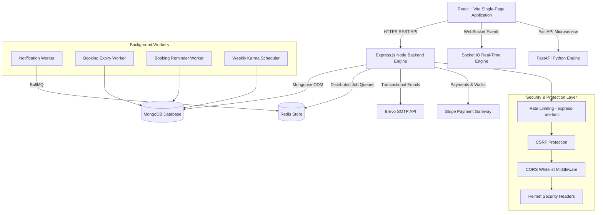
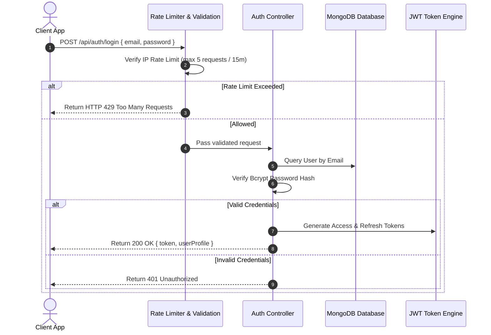
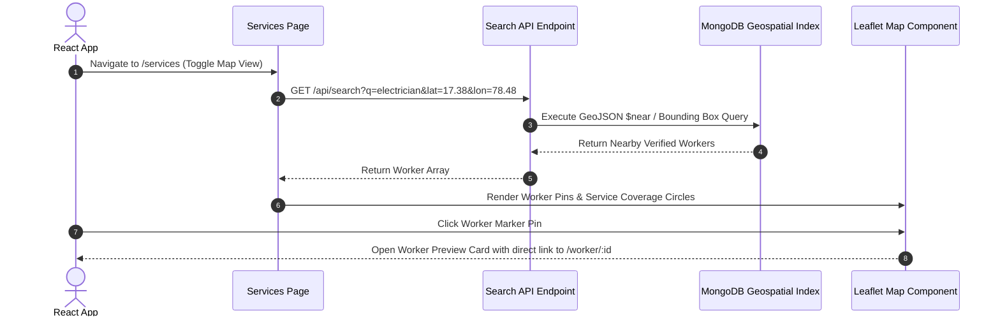

# 🛠️ FixNearby System Architecture

Welcome to the **FixNearby System Architecture Documentation**. This document provides a comprehensive technical overview of the system design, repository directory structure, data flows, technology stack, and module interactions across the application.

---

## 📖 Executive Summary

**FixNearby** is a modern, open-source hyperlocal service marketplace connecting users with nearby skilled workers (electricians, plumbers, carpenters, cleaners, technicians) in real time. The platform is architected around a decoupled **MERN (MongoDB, Express, React, Node.js)** core, supplemented by a **FastAPI** Python service gateway, **Socket.IO** real-time event pipeline, **Redis / BullMQ** distributed queues, and **Leaflet.js** geospatial mapping.

---

## 🏗️ High-Level System Architecture

FixNearby uses a decoupled client-server architecture. The frontend application communicates with the backend via RESTful APIs and Socket.IO WebSocket connections.



---

## 💻 Technology Stack Breakdown

| Layer | Technologies & Frameworks | Description / Purpose |
| :--- | :--- | :--- |
| **Frontend UI** | React 18, Vite, Tailwind CSS, Lucide Icons | Responsive single-page application with route-based lazy loading and dark mode. |
| **Mapping & Location**| Leaflet.js, Carto Voyager Tiles, Geolocation API | Interactive spatial mapping, worker density clustering, and service coverage radius bounds. |
| **Backend Core** | Node.js (v18+), Express.js, FastAPI (Python) | RESTful API server, route middleware pipelines, security headers, and single-instance bootstrap. |
| **Real-Time Communication** | Socket.IO | Bi-directional WebSocket channels for live chat messaging, presence status, and booking updates. |
| **Database** | MongoDB, Mongoose ODM | Document database for users, worker profiles, bookings, reviews, and audit logs. |
| **Caching & Queues** | Redis, BullMQ | Asynchronous job processing, rate limiting state, sliding-window throttling, and message queues. |
| **Authentication & Security** | JWT (JSON Web Tokens), Bcrypt, Helmet, CSRF | Dual token authentication, password hashing, CSP security headers, and anti-CSRF protection. |
| **Integrations** | Stripe SDK, Brevo (Sendinblue) Mail API | Digital wallet, payment processing, escrow, and transactional email notifications. |

---

## 📁 Repository Directory Structure

```
FixNearby/
├── .github/                  # GitHub Actions CI/CD workflows (ci.yml, ci-quality.yml)
├── client/                   # React + Vite Frontend Application
│   ├── src/
│   │   ├── components/       # Reusable UI components (Navbar, Footer, MapView, ThemeToggle, etc.)
│   │   ├── context/          # React Context Providers (AuthContext, LocationContext, ThemeContext, etc.)
│   │   ├── hooks/            # Custom React hooks (useSearch, useToast, useNetworkSync)
│   │   ├── i18n/             # Internationalization dictionaries
│   │   ├── pages/            # Page view components (Home, Services, WorkerProfile, Bookings, etc.)
│   │   ├── services/         # API client & HTTP service layer
│   │   └── utils/            # Client utility functions & formatting helpers
│   ├── index.html            # HTML entry point
│   ├── package.json          # Client dependencies & scripts
│   └── vite.config.js        # Vite bundler configuration
├── server/                   # Express.js Node Backend Application
│   ├── config/               # DB connection (db.js), environment validator, CORS origins
│   ├── controllers/          # Request handlers (authController, workerController, bookingController, etc.)
│   ├── middleware/           # Auth, rate limiting, validation, error handling, security headers
│   ├── models/               # Mongoose schemas (User, Worker, Booking, Review, AuditLog, etc.)
│   ├── routes/               # API route definitions (authRoutes, workerRoutes, bookingRoutes, etc.)
│   ├── services/             # Business logic & payment services
│   ├── socketHandlers/       # Socket.IO state machine & chat event handlers
│   ├── tests/                # Automated integration test scripts
│   ├── utils/                # Helper utilities (logger, sendEmail, gracefulShutdown, etc.)
│   ├── workers/              # Background job workers (notificationWorker, bookingExpiryWorker)
│   ├── package.json          # Server dependencies & scripts
│   └── server.js             # Server entry point & HTTP listener
├── docs/                     # System documentation (API_SPECIFICATION.md, ARCHITECTURE.md, etc.)
├── main.py                   # Single authoritative FastAPI Python entry point
├── .prettierrc               # Repository Prettier formatting config
├── .prettierignore           # Prettier ignore patterns
├── docker-compose.yml        # Multi-container orchestration config
└── README.md                 # Project introduction & setup instructions
```

---

## 🔄 Core Application Data Flows

### 1. User & Worker Authentication Flow


### 2. Service Search & Interactive Map View Flow


---

## 🔒 Security Architecture & Resilience

1. **Rate Limiting Perimeter**: Standardized rate-limiting rules (`express-rate-limit`) protect public authentication, password reset, and registration routes against brute-force attacks.
2. **Security Headers & CSRF**: Managed by `helmet` and anti-CSRF token verification cookies.
3. **Data Protection**: Sensitive password hashes are protected via `bcryptjs` with salt factor 10.
4. **Input Sanitization**: All incoming JSON payloads pass through input sanitization to block MongoDB operator injection and XSS payloads.

---

## 🚀 Onboarding Quick Start for Contributors

To get up and running locally:

```bash
# 1. Clone the repository
git clone https://github.com/sanket1035/FixNearby.git
cd FixNearby

# 2. Install dependencies for server and client
cd server && npm install
cd ../client && npm install

# 3. Start local development environment
# Terminal 1 (Backend):
cd server && npm run dev

# Terminal 2 (Frontend):
cd client && npm run dev
```

For full setup guidelines, refer to the [Developer Guide](docs/DEVELOPER_GUIDE.md) and [API Specification](docs/API_SPECIFICATION.md).
