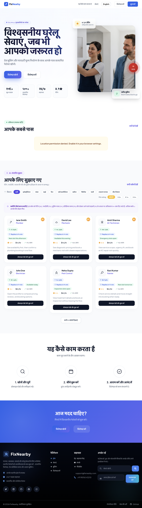
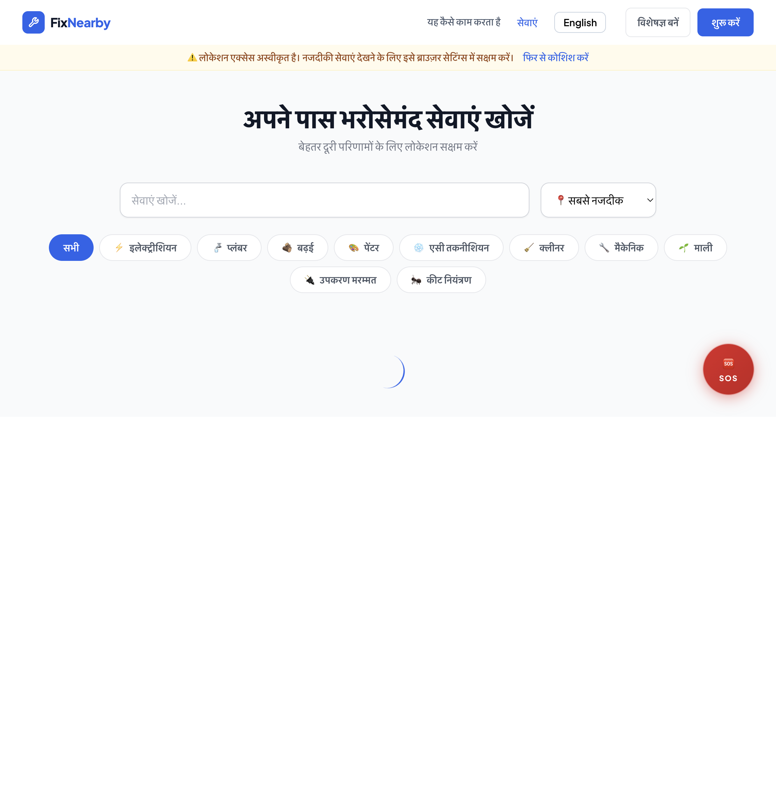
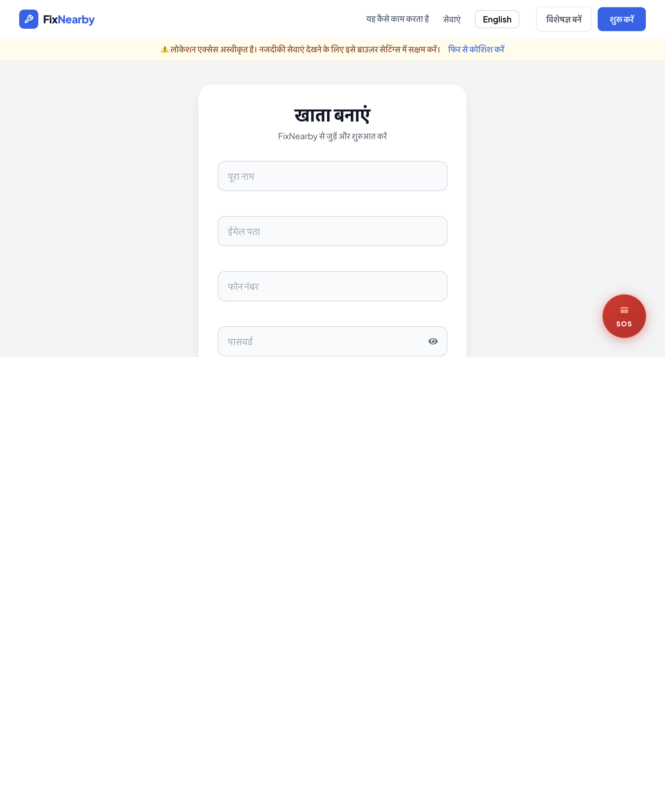
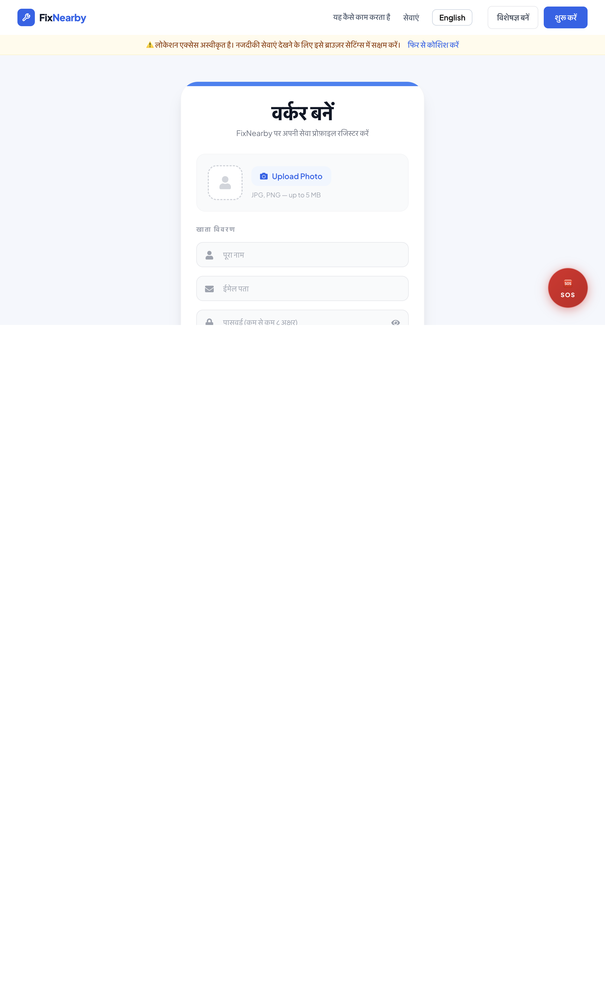

## PR: feat(i18n): complete Hindi language support coverage (NSoC'26 #187)

Closes #187

This PR completes Hindi language support for the requested UI areas and improves accessibility by localizing key labels, action text, guidance text, and numeric displays.

Summary of changes
- Added and wired Hindi translations for Home recommendation section, Services, Footer, Register, and Worker Register flows.
- Localized strings requested in issue discussion (recommendations, filters, location states, profile CTA, account/professional form labels, and terms text).
- Added reusable i18n keys in both English and Hindi locale files for maintainability.
- Added Hindi numeral rendering for visible UI numbers (ratings, counts, worker totals, min rating chips, rank badges, character counters, and other numeric labels in updated sections).
- Kept language toggle behavior intact and persistent via existing i18n setup.

Screenshots
- Home (Hindi):
  - 
- Services (Hindi):
  - 
- Register (Hindi):
  - 
- Worker Register (Hindi):
  - 

How to test
1. Run frontend:

```bash
cd client
npm install
npm run dev -- --host
```

2. Open the app in browser and switch language to Hindi.
3. Validate changed sections:
- Home recommendations content and labels in Hindi.
- Services and Footer translated labels and actions.
- Register and Worker Register form labels, hints, and validation messages.
- Numeric values rendered in Hindi digits in updated sections.
