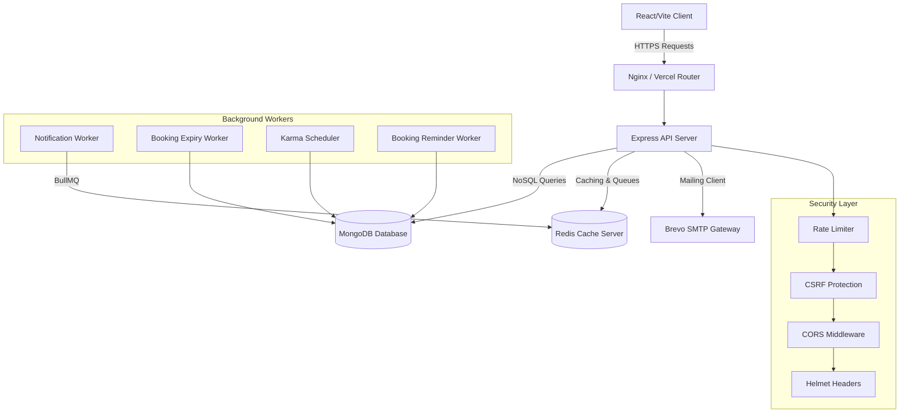
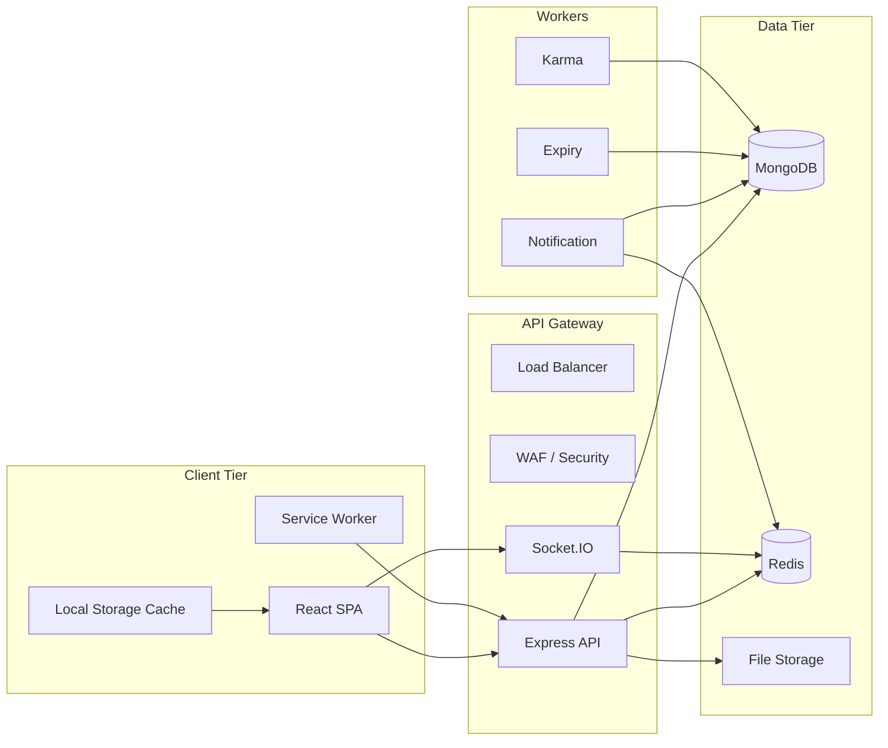
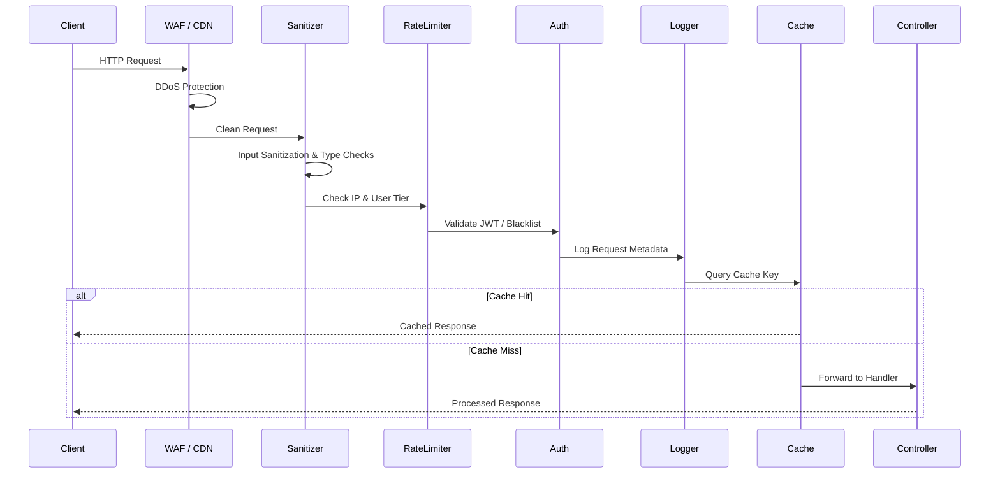
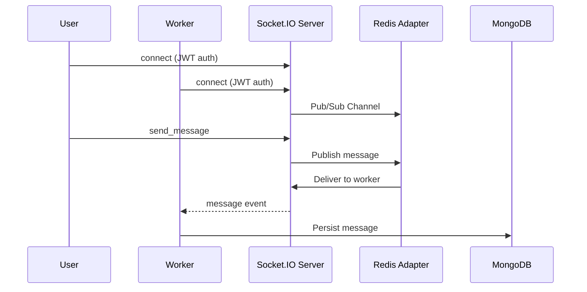
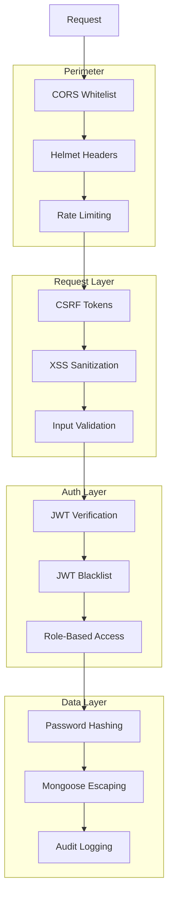

# FixNearby Architecture Documentation

This document describes the high-level system architecture, service components, background workers, and internal data processing patterns of the FixNearby application.

For detailed REST endpoints and Socket.IO contracts, see:
- [API Specification](./API_SPECIFICATION.md)
- [Real-Time Socket Protocols](./REALTIME_SOCKET_PROTOCOLS.md)
- [System Deployment Guide](./SYSTEM_DEPLOYMENT_GUIDE.md)

### 🛡️ Application Resilience & Error Handling Layer
- **Client Fallback UI** (`client/src/components/FallbackUI.jsx`): Isolated render error recovery.
- **Global Error Boundary** (`client/src/components/ErrorBoundary.jsx`): Telemetry & retry management.
- **Server Error Obfuscation** (`server/middleware/errorHandler.js`): Correlation IDs and safe stack trace suppression in production.

---

## 🏗️ System Overview

FixNearby is designed using a decoupled client-server model to ensure independent scaling, modular development, and separation of concerns.

### Key Service Layers
1. **Frontend (Client)**: A fast React single-page application built using Vite, styled using Tailwind CSS, and containing page components with route-based lazy loading. Includes offline support via service workers.
2. **Backend (Server)**: An Express.js REST API providing routing, controllers, input validation middleware, secure token authentication, and data models.
3. **Mailing Service**: External transaction email delivery configured using the Brevo SMTP SDK.
4. **Queue & Background Workers**: Redis-backed BullMQ message queues managing background notifications, retry strategies, and dead-letter log storage.
5. **Real-Time Layer**: Socket.IO for live chat, real-time booking updates, and availability notifications.
6. **Monitoring & Logging**: Structured JSON logging with Pino, error categorization middleware, and client-side error reporting.

---

## 📊 Data Flow Architecture

---

## 🚦 Request Processing Pipeline

Every incoming request to the server passes through the following secure pipeline stages before reaching the controller logic:

---

## 📈 Background Processing Engines

### 1. Weekly Karma & Trust Engine
The reliability of service workers is determined dynamically using the Weekly Karma Scheduler.
- **Weights Applied**:
  - **Completion Rate (40%)**: Ratio of `Completed` status bookings versus `Cancelled` status bookings.
  - **Review Rating (40%)**: Average rating of all reviews submitted for completed bookings.
  - **Responsiveness (20%)**: Initial responsiveness score recorded in the worker database profile.
- **Workflow**:
  - Automatically runs as a weekly cron job via `node-cron`.
  - Can be manually triggered by administrators/operators through a secure POST request to `/api/workers/recalculate-karma`.

### 2. Notification Worker & Dead-Letter Queue
To prevent blocking main thread processes, all outgoing notifications (Welcome emails, Booking confirmations, Status updates) are offloaded to a background queue.
- **Tech Stack**: BullMQ backed by a Redis connection.
- **Retry Mechanism**: Employs an exponential retry backoff strategy.
- **Dead-Letter Storage**: If a notification job fails repeatedly and exhausts its retry limit, the worker captures the error stack trace and logs a document inside the `DeadLetterJob` MongoDB collection for developer inspection.

### 3. Booking Expiry & Reminder Schedulers
- **Expiry Worker**: Checks every 60 seconds for pending bookings exceeding the response timeout and auto-cancels them.
- **Reminder Worker**: Sends push notifications or emails to users 24 hours before scheduled booking times.
- **Implementation**: Background interval runners using `setInterval` with plans to migrate to BullMQ repeating jobs.

### 4. Real-Time Communication Architecture

---

## 🔐 Security Architecture

---

## 🔄 Component Interaction Matrix

| Component | Technology | Dependencies | Scale Strategy |
|-----------|-----------|--------------|----------------|
| React Client | Vite + React 18 | Express API, Socket.IO | CDN / Vercel |
| Express API | Node.js + Express | MongoDB, Redis | Horizontal (stateless) |
| Socket.IO | Socket.IO + Redis | Redis adapter | Multi-instance via Redis |
| MongoDB | Mongoose 7 | - | Replica set / Atlas |
| Redis | ioredis | - | Cluster mode |
| BullMQ | BullMQ | Redis | Worker concurrency |
| Email | Brevo SDK | External API | Queue-backed |
